# 02. 環境構築ガイド（Cursor 導入・Phase 1）

～ Cursor（Hobby 枠）を Windows にインストールしてサインインするまで ～

> 🚀 **とにかく早く動かしたい方** → [`01_クイックスタート.md`](./01_クイックスタート.md)（15 分版）。
> 本ガイドは **仕組みも理解しながら一歩ずつ進める詳しい版**（20〜30 分）です。
> 「なぜ Cursor か / 全体像 / 用語」は [`00_導入スライド.md`](./00_導入スライド.md) にまとまっています。

---

## このガイドの位置づけ

```
   現在地: 【Phase 1】Cursor 導入 ← 本ガイド
   ────────────────────────────────────────
   Phase 1（本ガイド）  Cursor をインストール + サインイン     … 一度やれば OK
   Phase 2（次の 03）   リポジトリを開いて Chat にプロンプト投入 … 業務ごとに繰り返し
```

全体の学習ロードマップは [`00_導入スライド.md`](./00_導入スライド.md) の「学習ロードマップ」を参照。
本ガイドのゴールは **「Cursor をクリックすれば即動く状態」まで PC を整える** こと。教材の ZIP ダウンロード以降は [`03_ハンズオン.md`](./03_ハンズオン.md) で扱います。

### このガイドで人手で行うこと（①〜④のみ）

```
① cursor.com からインストーラをダウンロード   ← 必須
② インストーラを実行して Cursor をインストール ← 必須
③ Cursor を起動してサインイン（Hobby = 無料）  ← 必須
④ 基本設定（言語・テーマ・Privacy Mode）       ← 任意
```

> ※ Python / Node.js は **使いません**（ランタイム不要）。

---

## ① Cursor をダウンロード

ブラウザで公式サイト https://cursor.com/ を開き、Windows 版インストーラをダウンロードします。

> 💡 ファイルサイズはおおよそ 180MB 前後。ネットワーク環境により数十秒〜数分かかります。

**1. 公式サイト `cursor.com` の「Windows 版をダウンロード」をクリック**

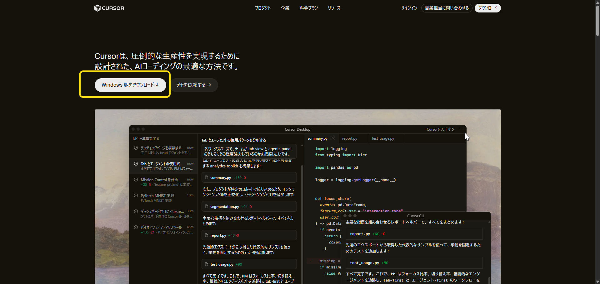

**2.「名前を付けて保存」で保存先（ダウンロード フォルダなど）を選んで保存**

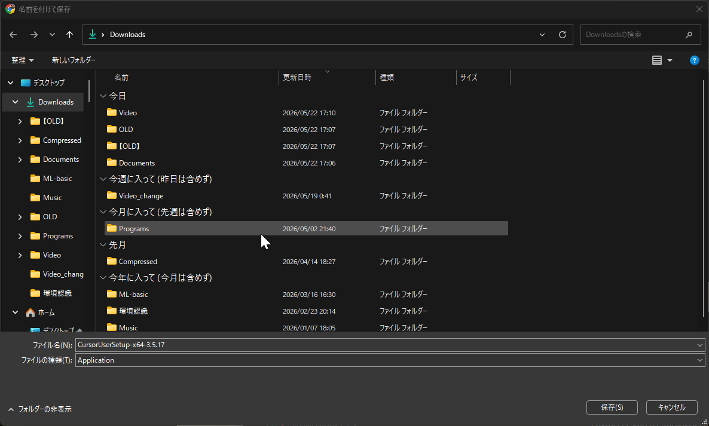

**3. ダウンロードフォルダに `CursorUserSetup-x64-x.x.x.exe`（約 180MB）が入る**

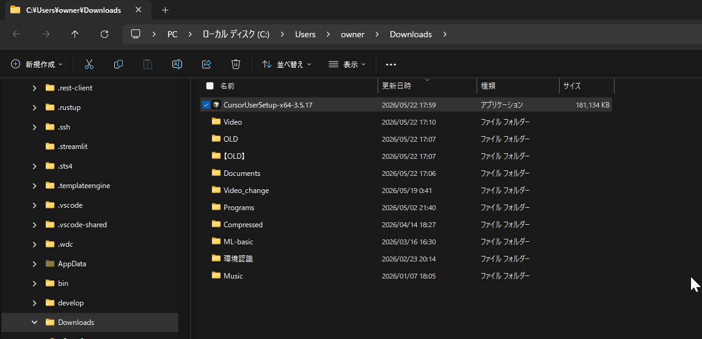

---

## ② Cursor をインストール

**1. ダウンロードした `CursorUserSetup-x64-x.x.x.exe` をダブルクリック（または右クリック →「開く」）。UAC が出たら「はい」**

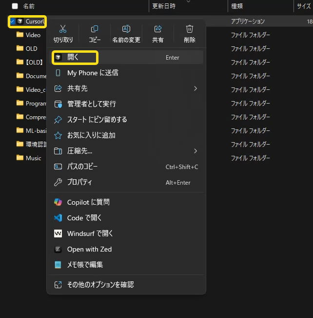

**2.「使用許諾契約書の同意」で「同意する」を選んで「次へ」**

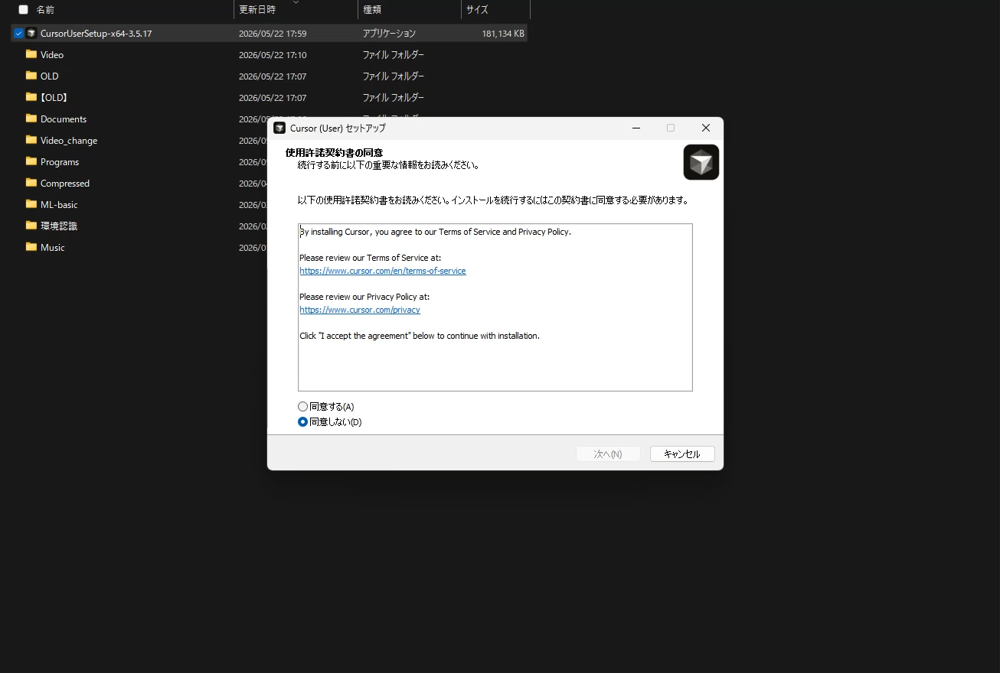

**3.「追加タスクの選択」はそのまま「次へ」（既定で OK）**

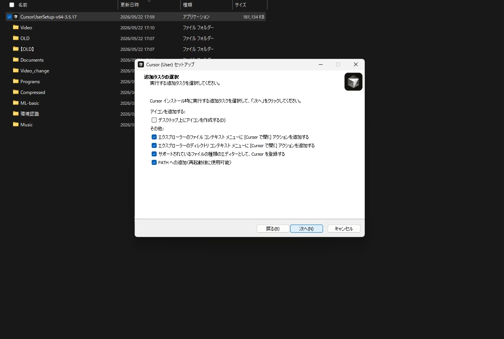

**4.「インストール準備完了」で「インストール」をクリック**

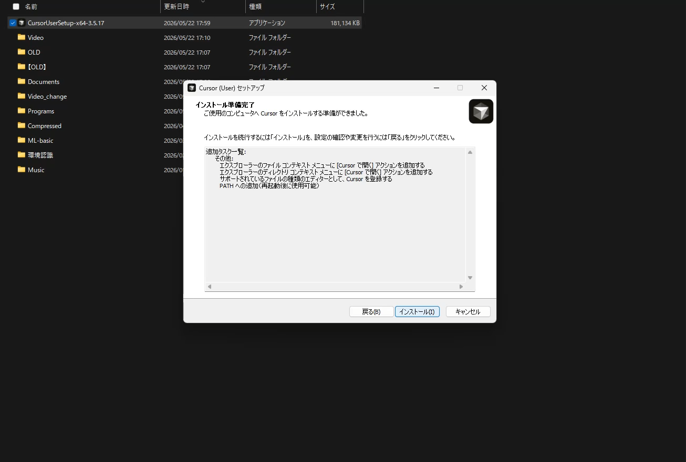

**5. 完了後 `Finish` を押すと Cursor が起動する（`Free Plan` ＝ Hobby 枠の表示）**

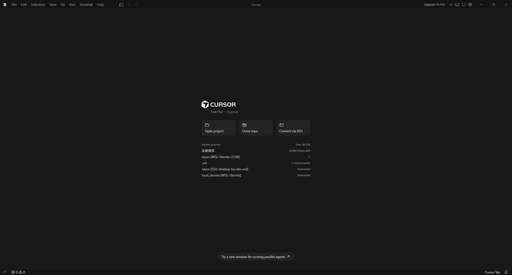

> 起動しなければスタートメニューから `Cursor` を選んで起動してください。

---

## ③ Cursor にサインイン（Hobby = 無料）

最新の Cursor では、**右上の設定（歯車）アイコン → アカウント** からサインインします。

**1. 右上の歯車（設定）アイコンをクリックして `Cursor Settings` を開く**

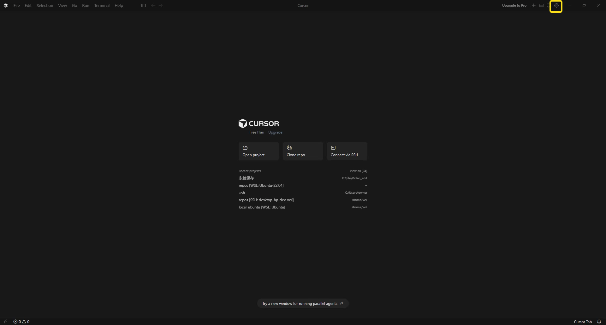

**2.「General」→「Cursor Account」の `Open` をクリック（未サインインならサインイン画面が開く）**

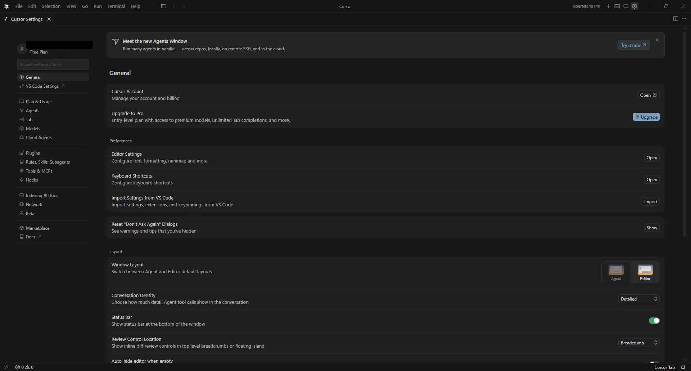

**3. サインイン方法を選ぶ：Google / GitHub / Apple / メールアドレス のいずれかで「続行」**

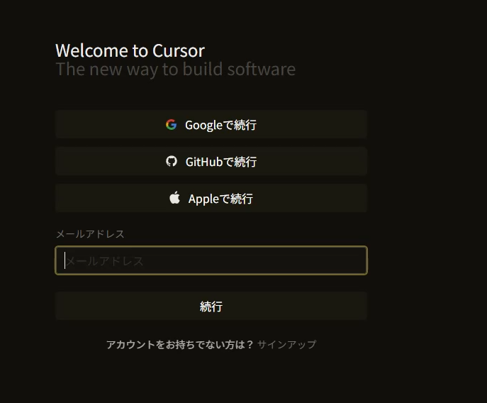

- アカウントが無い場合は画面下の **「サインアップ」**から作成（**GitHub は不要**、メールアドレスだけで OK）
- 新規アカウントはデフォルトで **Hobby 枠（無料）**
- 認証完了後、Cursor 右下にアカウント名が表示されれば成功 ✅

### サインイン時の安心ポイント（非エンジニア向け）

非エンジニアの方が不安になりやすい点を先に整理します。

```
   ✅ クレジットカードは不要
      → Hobby 枠は Free。カード番号を一切登録せず使い始められる
        （課金は Pro / Teams を自分で選んだときだけ）

   📱 SMS（電話番号）認証は必要
      → アカウント作成時に携帯電話の SMS でコード認証を求められる
        （本人確認のため。番号は認証用で、課金とは無関係）

   🐙 GitHub アカウントは必須ではない
      → GitHub / Google / メールのいずれかで OK。メールだけでも始められる

   🔒 コードのデータ共有は「必須ではない」
      → Privacy Mode を ON にすれば、入力したコード/ファイルが学習・保存に使われない
        実業務データを扱うなら ON 推奨（手順は §④）
```

> 💡 まとめると **「カード登録なし・メールだけで・無料で」始められ、データ共有も自分でオフにできる**。
> Hobby 枠の事実一覧（料金/カード/SMS/GitHub/データ共有/上限）は [`04_Cursor操作.md`](./04_Cursor操作.md) §1.1 を参照。
> プライバシーの詳細は公式 [Privacy / Security](https://cursor.com/privacy)。

---

## ④ 基本設定（任意）

### 言語を日本語にする

1. `View → Command Palette`（または `Ctrl+Shift+P`）
2. `Configure Display Language` を選択 → `日本語 (ja)` → Cursor を再起動

### テーマ・フォント

- `File → Preferences → Settings`（または `Ctrl+,`）から好みに変更

### プライバシーモードを有効にする（実業務データを扱うなら推奨）

1. `File → Preferences → Cursor Settings`（または右上の歯車 → Cursor Settings）
2. `Privacy` / `Privacy Mode` の項目を **ON** にする
3. ON の状態では、入力したコード/ファイルが Cursor 側で学習・保存に使われません

> 💡 設定 UI の名称は Cursor のバージョンで変わることがあります。見つからない場合は設定検索に `privacy` と入力。

---

## Phase 1 完了チェック（先に進む前に確認）

```
   [ ] スタートメニューで "Cursor" を検索 → 起動できる
   [ ] Cursor アイコンをクリック → Welcome 画面 / エディタが表示
   [ ] 起動後、右下にアカウント名が表示される（= サインイン済み）
   [ ] Help → About でバージョン情報が表示される

   全部 ✓ → 03_ハンズオン.md へ進む
   1 つでも ✗ → そのステップに戻ってやり直す
```

> 詰まったら → [`04_Cursor操作.md`](./04_Cursor操作.md) の **§8.A 導入・インストール / §8.B サインイン**。

---

## 次のステップ → ハンズオン

**[`03_ハンズオン.md`](./03_ハンズオン.md)** に進んでください。教材を ZIP でダウンロード → Open Folder → Chat にプロンプト投入 → 初回タスクの確認、までを扱います。
