# 03. ハンズオン（リポジトリを開いて初回タスク・Phase 2）

～ 教材を ZIP でダウンロード → Cursor で開く → Chat にプロンプト投入 → 初回タスクで動作確認まで ～

> 🚀 **最短で済ませたい方** → [`01_クイックスタート.md`](./01_クイックスタート.md) の ③〜⑤。
> 本ガイドは **各ステップで何が起きているかを理解しながら進める** 詳しい版です。
> 全体の学習ロードマップは [`00_導入スライド.md`](./00_導入スライド.md)。

---

## 前提（Phase 1 が完了していること）

本ガイドは **Cursor 本体のインストール + サインイン（Phase 1）が済んでいる前提**です。
未完了の方は先に [`02_環境構築ガイド.md`](./02_環境構築ガイド.md) を。

```
   [ ] Cursor が起動する
   [ ] 右下にアカウント名が表示されている（= サインイン済み）
```

---

## このリポジトリの中身（前提知識）

本キットには **Cursor 用ルール + 事務処理プロンプトメモ + サンプルデータ** が同梱されています。
**シェルスクリプトや実行コードは入っていません** — 実装は Cursor の Chat に都度依頼して生成する設計です。

```
   📦 cursor-office-automation-starter/ の中身
   ─────────────────────────────────────────────────────────────
   ┌── あなたがよく開く ──────────────────────────────────────┐
   │  src/office-task/README.md   → 事務処理プロンプト 8 本（Chat にコピペ） │
   │  src/office-task/data/       → サンプル CSV/TXT                       │
   └──────────────────────────────────────────────────────────┘
   ┌── Cursor が自動で読み込む（操作不要）────────────────────┐
   │  AGENTS.md / .cursor/rules/repo.mdc → AI への作業ルール   │
   └──────────────────────────────────────────────────────────┘
```

> **ランタイム不要**: Python / Node.js はインストールしません。Cursor + Windows 標準機能（PowerShell / Excel / エクスプローラ）で完結します。
> 適用されるルールの中身は [`04_Cursor操作.md`](./04_Cursor操作.md) §6。

> 📋 **プロンプト例（8 本）は [`src/office-task/README.md`](../../src/office-task/README.md) にまとまっています。**
> メール / 議事録 / 集計 / マッチング / 要約 / 見積比較 / ファイル整理 — このファイルを開いて、使いたいセクションをコピーして Chat に貼るだけです。

---

## ハンズオン手順

```
   ① 教材を ZIP でDL&展開 → ② フォルダを Cursor で開く → ③ フォルダ信頼 → ④ Chat を開く → ⑤ プロンプト投入 → 🎉
```

### ① 教材を ZIP でダウンロードして展開する

むずかしい操作（git など）は使いません。**ZIP ファイルを落として展開するだけ**です。普段ファイルをダウンロードして解凍するのと同じ感覚で OK。

**1. 教材ページで緑の `Code` ボタン →「Download ZIP」をクリック**
（教材ページ: https://github.com/kurosawa-kuro/cursor-office-automation-starter ）

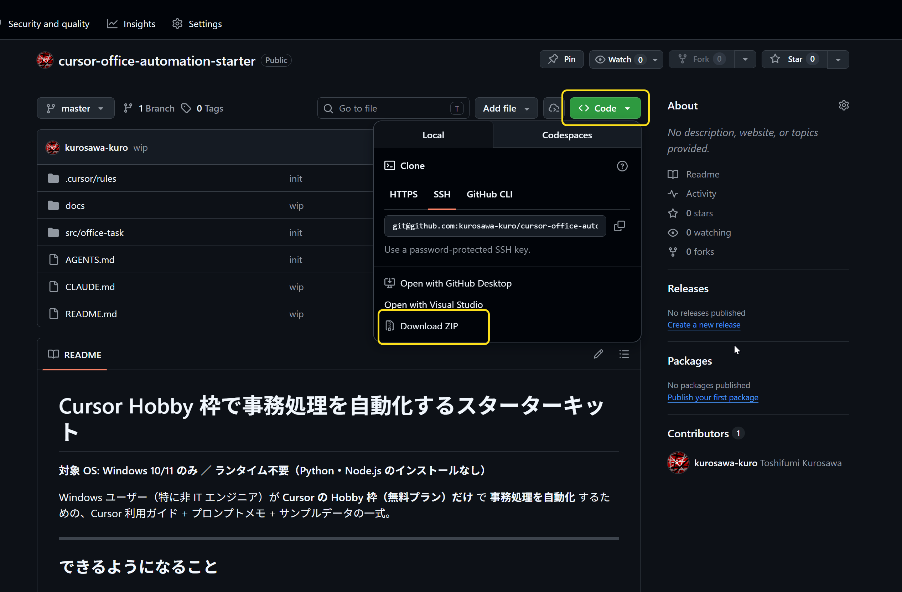

**2. ダウンロードフォルダに ZIP（`cursor-office-automation-starter-master`）が入る**


**3. その ZIP を右クリック →「すべて展開」**


**4. 展開先を確認して「展開」ボタンを押す**

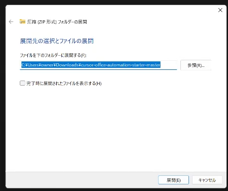

> 💡 展開すると **`cursor-office-automation-starter-master`** というフォルダができます。末尾の `-master` は GitHub の仕様なので**正常**です。

**5. 展開後は「ZIP（圧縮ファイル）」と「フォルダ」の 2 つが並ぶ**

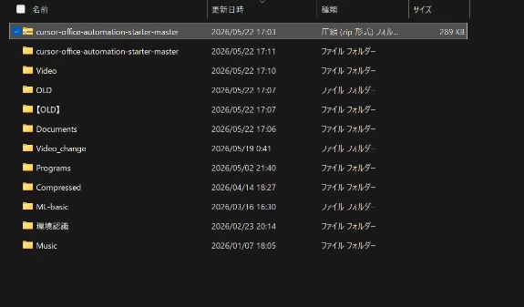

**6. もう使わない ZIP（圧縮ファイル）を右クリック →「削除」**

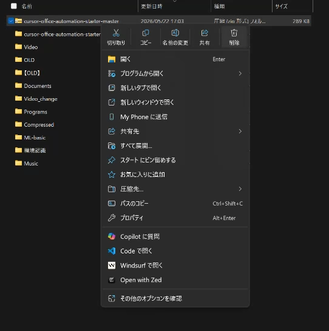

> 💡 残すのは展開した**フォルダ**だけで OK。圧縮ファイル（ZIP）はもう使いません。

### ② 展開したフォルダを Cursor で開く

**展開したフォルダを右クリック →「Cursor で開く」**


**開くと Cursor が起動し、タイトルと左サイドバーにプロジェクト名（`cursor-office-automation-starter-master`）が表示される**

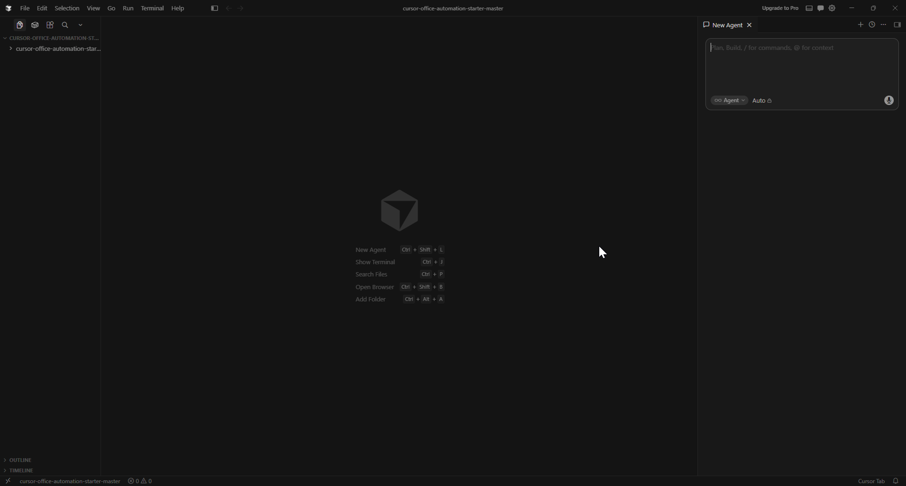

> 💡 左サイドバーの `▸ cursor-office-automation-starter-master` をクリックして開くと、`README.md` や `src/office-task/` などの中身が見えます。
> 別の開き方: Cursor を起動して `File → Open Folder` から `cursor-office-automation-starter-master` フォルダを選んでも同じです。

### ③ フォルダ信頼の確認
初回は「このフォルダを信頼しますか？」が出ます。`Yes, I trust the authors` をクリック。
左サイドバーに `README.md` / `AGENTS.md` / `.cursor/` / `docs/` / `src/office-task/` が見えれば OK。

### ④ Chat (Ctrl+L) を開く
`Ctrl+L`（または右上の Chat アイコン）。`.cursor/rules/repo.mdc` と `AGENTS.md` のルールが自動でコンテキストに加わります（Chat 上部に「Rules applied」表示が出る場合あり）。

### ⑤ 初回プロンプトで動作確認
1. 左サイドバーから [`src/office-task/README.md`](../../src/office-task/README.md) を開く
   - 💡 **Markdown プレビューで開くと読みやすい**: 左サイドバーで `README.md` を右クリック →「Open Preview」（または開いた状態で `Ctrl+Shift+V`）。記号だらけの元テキストではなく、整形された見た目で読めます

**`README.md` を右クリック →「Open Preview」を選ぶ**

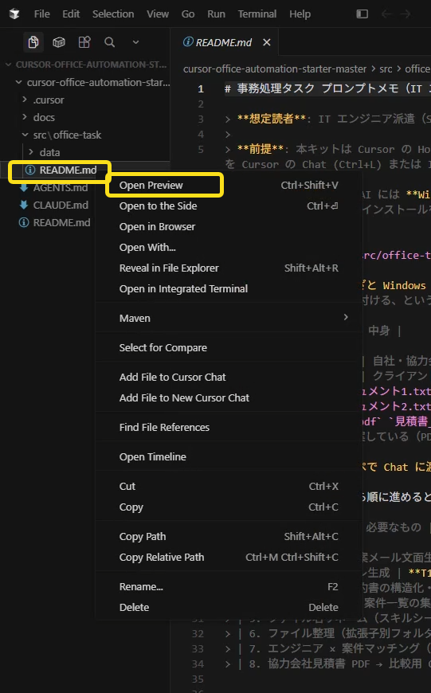

**右側に整形されたプレビューが開く（記号なしで読みやすい表示）**

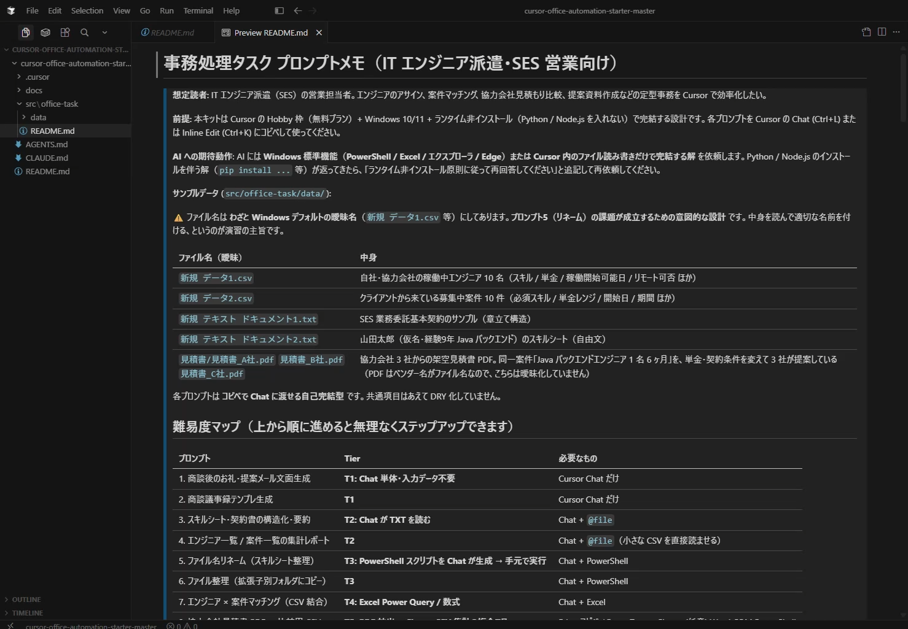

2. 「**プロンプト1: 商談後のお礼・提案メール文面生成**」の内容を確認する

**プレビューで「プロンプト1」の内容（依頼内容・入力情報・出力形式）を確認**

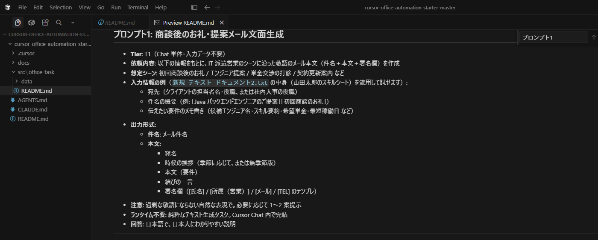

3. 入力に使うサンプルを用意する（この例では山田太郎のスキルシート）

> 💡 サンプルは説明用に**一般的な IT 人材（Java エンジニア）**で用意しています。AI・ML・ビッグデータなど、どの分野の人材派遣でも手順は同じです。

**`src/office-task/data/新規 テキスト ドキュメント2.txt`（スキルシート）を開く**


**その `.txt` を右クリック →「Add file to Cursor Chat」で Chat に添付**


**Chat（右パネル）の入力欄にファイルが添付された**


4. プロンプトをコピーして Chat に貼り、送信する


**プレビューで「プロンプト1」のセクション全体を選択してコピー**


**コピーしたプロンプトを Chat の入力欄に貼り付け**

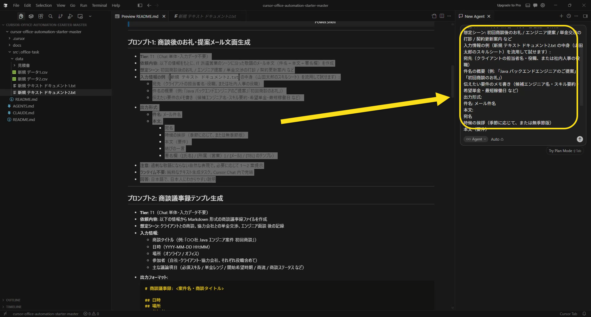

**添付したスキルシート ＋ プロンプトが Chat に入った状態**


**入力欄の送信ボタン（↑）を押して送信**

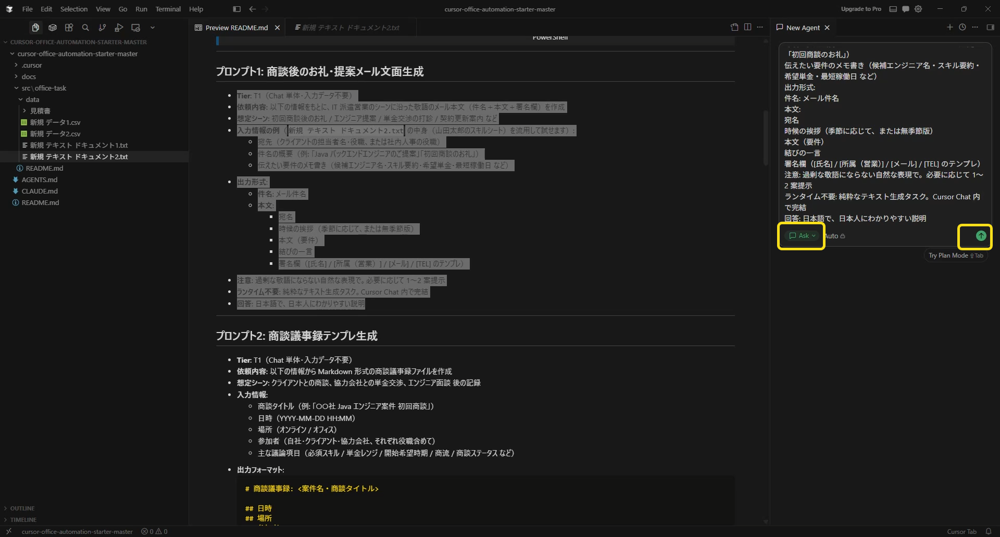

5. 数秒で AI がメールの下書きを返す

**AI がメール文面を生成し始める**

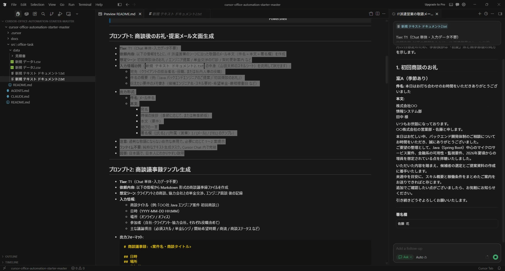

**お礼メールの下書き（件名・宛名・本文・署名欄）が返ってくる**

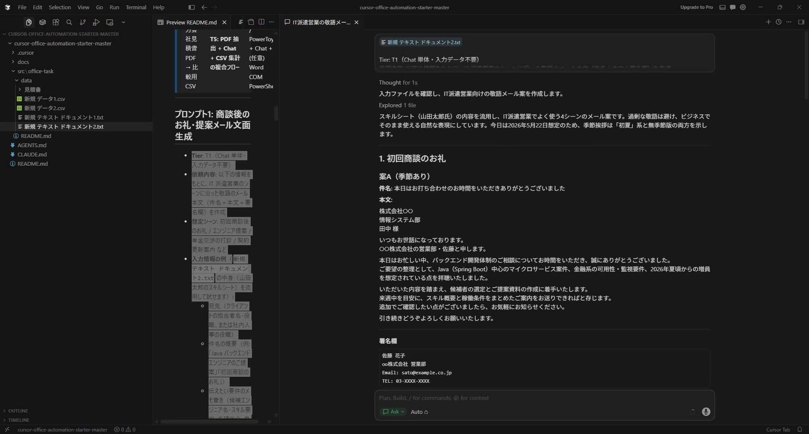

**続けて「使い方のポイント」などの補足も返る**

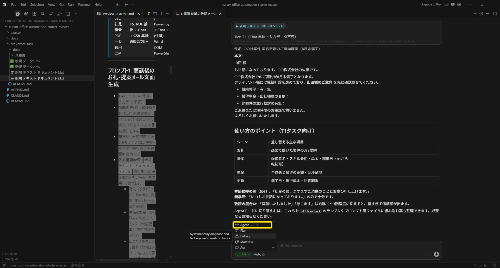

6.（応用・任意）結果をファイルに書き出してもらう

**「テキストで書き出して。保存先は `src/office-task/data`」と続けて依頼**


**新しいテキストファイルが作られ、メール文面が保存される（元のサンプルはそのまま）**

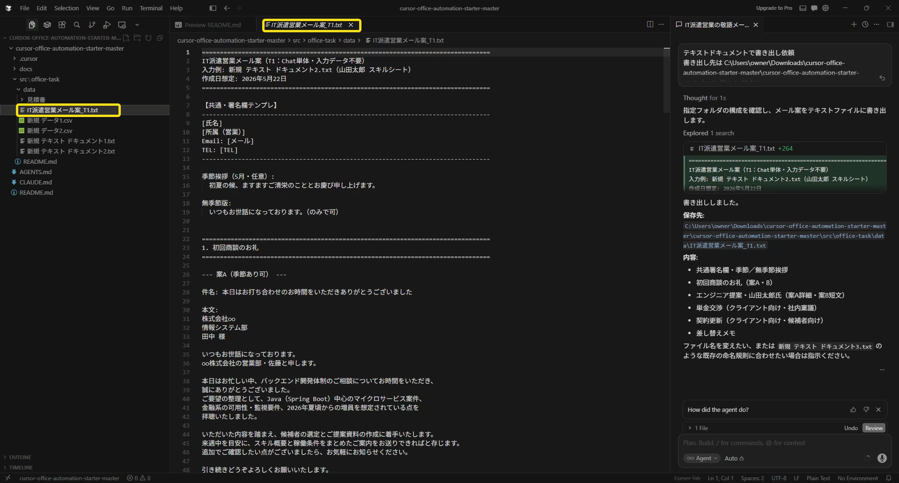


期待される応答:
```
   ・件名 / 宛名 / 時候の挨拶 / 本文 / 結び / 署名欄を含む日本語ビジネスメール
   ・過剰な敬語にならない自然な表現
   ・必要に応じて 1〜2 案提示
```

> 🎉 これで「日本語で頼む → 成果物が返る」を体験できました。

> 📌 **チュートリアルは上から順に進めてください**（このハンズオンの ①〜⑥、教育資料全体では 00 → 01 → 02 → 03 → 04）。
> 途中を飛ばすと前提（インストール・フォルダを開く・ルール適用 など）が抜け、うまく動かない／整合性が崩れる原因になります。

慣れたら、次は `@file` でサンプル CSV を読ませるタスク（プロンプト4: 集計レポート）に進みます。`@` 記法の使い方は [`04_Cursor操作.md`](./04_Cursor操作.md) §2.3。

> 応答に Python コードや `pip install` が混ざる場合の対処は [`04_Cursor操作.md`](./04_Cursor操作.md) §8.D。

---

## ハンズオン後 — ここからは「くり返し（ループ）」です

環境構築は **一度やれば OK**。あとは業務が発生するたびに、**同じ流れをくり返すだけ**です。

```
   ┌────────────────────────────────────────────────┐
   │  ① 新しい業務が発生（メール / 集計 / 整理 …）       │
   │           ↓                                     │
   │  ② src/office-task/README.md から               │
   │     使うプロンプトを選んでコピー                   │
   │           ↓                                     │
   │  ③ Chat (Ctrl+L) に貼って送信                    │
   │           ↓                                     │
   │  ④ 返ってきた結果を使う／ファイルに保存            │
   │           ↓                                     │
   │     ① へ戻る（業務が来るたびにくり返し）           │
   └────────────────────────────────────────────────┘
```

新しい業務が増えても、覚えることは増えません。**「プロンプトを選んで貼るだけ」** の同じループの中で回り続けます。

- 事務タスクのプロンプト本体 → [`../../src/office-task/README.md`](../../src/office-task/README.md)
- 日常の作業フロー → [`../05_運用.md`](../05_運用.md)
- Cursor の機能・操作の詳細 → [`04_Cursor操作.md`](./04_Cursor操作.md)

> 詰まったら → [`04_Cursor操作.md`](./04_Cursor操作.md) の **§8 統合トラブルシューティング**（§8.C 取得・Open / §8.D Chat・動作）。
